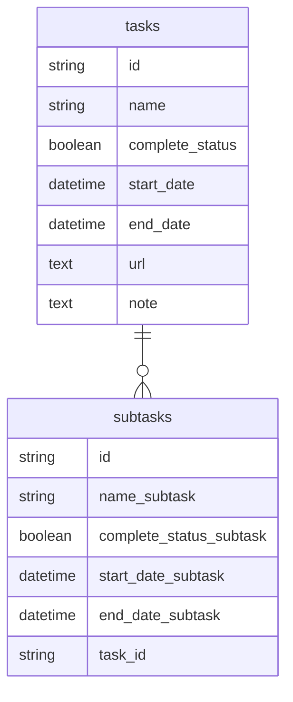

# TaskApp
重要度が高く＋緊急度が低いタスク専用の管理ツールです。 
具体的には「期限があるが、すぐに着手できない/する必要がないタスク」を想定しています。 
また、用途は主に個人用を想定しています。 
タスク名(1~50文字以内)と実施予定日のみ必須項目で、任意でサブタスクが3つまで入力できます。 

# URL
https://task-app-1pb2.onrender.com/

# 作成の背景
思い出す労力や時間を減らしたい
- 現状、IPhoneのリマインダーを使っているが、簡易的なメモに留まっており、いざ実施するときに何をやるべきか思い出す必要がある。
- 具体例：結婚式関連でやることがあって、リマインダーに「結婚式」と日付には「着手できそうな日付」をメモした
   - 問題：以下を思い出す必要がある
    - 具体的に何をするか
     - 何を実施するか思い出すためにどこを参照すべきか
     - いつまでに完了するべきか
→以下のような使い分けをしたいと考えた
- リマインダーは重要でも緊急でもないが、時間ができたらやりたいことをパッとメモするように使う
- TaskAppでは「重要度が高く＋緊急度が低いタスク専用」で使い、思い出す労力をなるべく減らすように、タスク名以外の情報も入力する

# 画面一覧
https://www.figma.com/file/BjpdSQPM6b1qrXOndbBZup/Task-Management?node-id=0%3A1&t=eIS8QoIgpF4uMULl-1

# 機能一覧
- タスク作成/編集/削除
 - タスク
   - 名前
   - ステータス (完了/未完了)
   - 実施予定日 （いつやるか）
   - 期限 （いつまでに完了する必要があるか）
   - 作業再開する時に確認すること
    - リンク (参照していたページ/チャットのリンクなど)
    - メモ
      チャットなどリンク貼り付け
　	- サブタスク
   - 名前
    - ステータス
    - 実施予定日
    - 期限
- タスク一覧表示
 - ステータス(完了/未完了)によってタスクを出し分け
 - 実施予定日が近い順に表示

# 使用技術
- Ruby 2.7.6
- Ruby on Rails 7.0.4
- Postgre SQL 14.6

# DB

   
